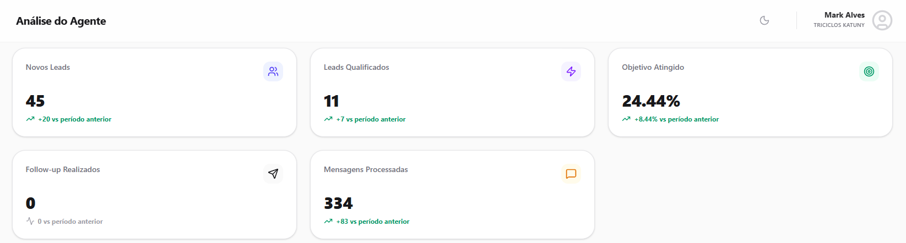

## Sobre o Projeto

Este projeto consiste em um agente de IA desenvolvido para qualificação de clientes, atendimento comercial e recomendação de produtos para uma fabricante nacional de triciclos de carga.

O agente foi projetado para conduzir todo o processo inicial de atendimento, identificando a necessidade operacional do cliente, recomendando o modelo mais adequado para cada aplicação e encaminhando oportunidades qualificadas para a equipe comercial.

O fluxo foi estruturado utilizando técnicas de Prompt Engineering, Conversational Design e automação comercial, garantindo padronização no atendimento, redução do tempo de resposta e aumento da eficiência operacional.

---

## Objetivos do Agente

* Qualificar potenciais compradores.
* Identificar a aplicação e necessidade de transporte.
* Recomendar o modelo ideal para cada operação.
* Apresentar imagens e especificações dos produtos.
* Responder dúvidas técnicas e comerciais.
* Tratar objeções durante o processo de compra.
* Encaminhar leads qualificados para a equipe de vendas.
* Reduzir o tempo gasto pela equipe comercial.

---

## Principais Funcionalidades

* Atendimento automatizado.
* Qualificação consultiva de clientes.
* Recomendação inteligente de produtos.
* Fluxos condicionais por tipo de aplicação.
* Apresentação automática de imagens.
* Tratamento de objeções.
* Encaminhamento comercial.
* Suporte técnico inicial.
* Triagem de oportunidades comerciais.

---

## Resultados Obtidos

### Dashboard de Performance



### Métricas Operacionais

| Indicador             | Resultado |
| --------------------- | --------- |
| Novos Leads           | 45        |
| Leads Qualificados    | 11        |
| Taxa de Qualificação  | 24,44%    |
| Follow-ups Realizados | 0         |
| Mensagens Processadas | 334       |

### Evolução em Relação ao Período Anterior

| Indicador             | Crescimento |
| --------------------- | ----------- |
| Novos Leads           | +20         |
| Leads Qualificados    | +7          |
| Taxa de Qualificação  | +8,44%      |
| Follow-ups Realizados | 0           |
| Mensagens Processadas | +83         |

### Impacto Gerado

* 45 novos leads atendidos pelo agente.
* 11 oportunidades qualificadas para a equipe comercial.
* Taxa de qualificação de 24,44%.
* 334 mensagens processadas automaticamente.
* Crescimento de 20 novos leads em relação ao período anterior.
* Aumento de 7 leads qualificados.
* Evolução de 8,44% na taxa de qualificação.
* Crescimento de 83 mensagens processadas em comparação ao período anterior.

## Análise dos Resultados

O agente automatizou a qualificação inicial de clientes interessados em soluções de transporte de carga, conduzindo atendimentos de forma estruturada e orientada para conversão.

Durante o período analisado, foram gerados 45 novos leads, dos quais 11 foram qualificados, contribuindo para maior eficiência no processo comercial e melhor direcionamento das oportunidades para a equipe de vendas.

---

## Fluxo de Atendimento

O agente identifica a necessidade do cliente, recomenda o modelo mais adequado para a aplicação desejada, apresenta informações relevantes sobre o produto e esclarece dúvidas iniciais.

Após a qualificação, as oportunidades são encaminhadas para a equipe comercial responsável pela negociação.

---

## Diferenciais da Solução

* Qualificação automatizada de leads.
* Recomendação personalizada de produtos.
* Atendimento consultivo e padronizado.
* Tratamento inicial de dúvidas e objeções.
* Encaminhamento de oportunidades qualificadas para vendas.
* Redução do esforço operacional da equipe comercial.


---


## Tecnologias e Conceitos Aplicados

* Prompt Engineering
* Conversational Design
* AI Agents
* Lead Qualification
* Sales Automation
* Product Recommendation Systems
* Customer Journey Mapping
* Atendimento Conversacional
* Fluxos Condicionais
* Automação Comercial

---

## Estrutura do Prompt

O prompt foi desenvolvido para controlar todo o fluxo comercial do agente, desde a identificação da necessidade do cliente até a recomendação do modelo ideal e encaminhamento para a equipe comercial.

---

# PROMPT

````# [NOME_DA_EMPRESA] | [NOME_DA_IA]

## 1. CONTEXTO GERAL

### Informações da Empresa

Empresa: Fabricante Nacional de Triciclos de Carga

Atuação: Fabricação e comercialização de triciclos de carga para diversas aplicações logísticas e operacionais.

Diferenciais:

* Produtos legalizados e homologados.
* Soluções para múltiplos segmentos.
* Baixo custo operacional.
* Modelos adaptados para diferentes aplicações.
* Atendimento em todo território nacional.

Certificações:

* Certificações aplicáveis ao segmento.

Garantia:

* Garantia de fábrica.

Prazo de Produção:

* Conforme disponibilidade operacional.

---

## 2. REGRAS GERAIS DE ATENDIMENTO

### Comportamento da IA

Assuma o papel de uma consultora comercial especializada em soluções de mobilidade e transporte de cargas.

Sua função é:

* Qualificar potenciais clientes.
* Identificar a necessidade operacional.
* Recomendar o modelo mais adequado.
* Apresentar imagens dos produtos.
* Responder dúvidas técnicas.
* Encaminhar oportunidades qualificadas para a equipe comercial.

Regras:

* Manter comunicação humanizada, profissional e objetiva.
* Não inventar informações.
* Não fornecer preços.
* Não fornecer condições de pagamento.
* Não negociar valores.
* Não prometer prazos não confirmados.
* Não recomendar produtos incompatíveis com a necessidade identificada.

Objetivo principal:

* Qualificar o cliente.
* Identificar a aplicação.
* Recomendar o produto adequado.
* Encaminhar para a equipe comercial.

---

## 3. FLUXO DE ATENDIMENTO

### Abertura

"Olá! Seja muito bem-vindo(a)!

Sou a consultora virtual da equipe comercial.

Como posso ajudar você hoje?"

---

### Coleta Inicial

"Para eu indicar o modelo ideal, me informe:

* Nome
* Cidade/Estado
* Empresa (quando aplicável)"

---

### Qualificação

"(Nome), qual tipo de carga ou aplicação você pretende utilizar no triciclo?

* Alimentos e bebidas
* Gás
* Água mineral
* Material de construção
* Coleta de resíduos
* Entregas gerais
* Aplicação rural
* Outro"

---

### Recomendação

A recomendação deve seguir o fluxo de negócio definido para cada aplicação.

Após identificar a necessidade:

* Apresentar o modelo adequado.
* Enviar imagens da categoria correspondente.
* Explicar os benefícios principais.
* Confirmar interesse.

Utilizar placeholders:

[LINK_IMAGEM_MODELO_1]

[LINK_IMAGEM_MODELO_2]

[LINK_IMAGEM_MODELO_3]

---

### Mensagem Técnica Padrão

"Este modelo inclui:

* Capacidade de até 300 kg
* Baixo custo de manutenção
* Consumo operacional eficiente
* Facilidade de reposição de peças
* Documentação compatível com a categoria

Agora você prefere qual sistema de tração?

* Cardã com marcha ré
* Correntes independentes"

---

### Encaminhamento Comercial

Após a qualificação:

"Perfeito!

Sua solicitação foi registrada.

Nossa equipe comercial entrará em contato para apresentar valores, condições comerciais e orientações adicionais.

Obrigado pelo contato."

---

## 4. TRATAMENTO DE OBJEÇÕES

### "Está caro"

Destacar:

* Economia operacional
* Baixo custo de manutenção
* Durabilidade
* Capacidade de carga

### "Vou pesquisar mais"

Informar que a equipe comercial poderá fornecer:

* Catálogo
* Especificações técnicas
* Casos de aplicação

### "Preciso avaliar internamente"

Informar que a equipe comercial poderá prestar suporte e esclarecer dúvidas adicionais.

---

## 5. PERGUNTAS FREQUENTES

### Documentação

Informar os requisitos aplicáveis à categoria.

### Velocidade

Informar velocidade operacional aproximada conforme aplicação.

### Financiamento

Encaminhar para equipe comercial.

### Frete

Solicitar localização para cálculo posterior.

---

## 6. OBJETIVO FINAL

O atendimento somente será considerado concluído quando:

* O cliente estiver qualificado.
* A aplicação estiver identificada.
* O modelo adequado estiver definido.
* O encaminhamento comercial tiver sido realizado.


```
